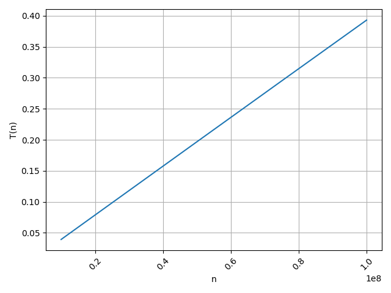

 # Linear Search Performance Benchmark
 
 ## Analysis
 

 
 The plotted graph of `T(n)` versus `n` shows a nearly **perfect linear relationship**.
 This confirms that the time complexity of the linear search algorithm is indeed **O(n)**.
 
 To further verify linearity, we calculate the constant $( c_{\text{local}} = \frac{T(n)}{n} )$ for each data point:
 
 | n (elements) | T(n) (seconds) | c_local (seconds per element) |
 | ------------ | -------------- | ----------------------------- |
 | 10,000,000   | 0.039328       | 3.932800e-9                   |
 | 20,000,000   | 0.078715       | 3.935749e-9                   |
 | 50,000,000   | 0.196756       | 3.935119e-9                   |
 | 75,000,000   | 0.294965       | 3.932866e-9                   |
 | 100,000,000  | 0.392885       | 3.928850e-9                   |
 
 The values of $( c_{\text{local}} )$ remain almost constant as ( n ) increases, indicating that the runtime grows linearly with respect to input size.
 
 **Average constant $(( c_{\text{avg}} ))$**:
 
$( c_{\text{avg}} = 3.93318 \times 10^{-9} \text{ seconds per operation} )$
 
 This constant represents the approximate time taken by one iteration of the linear search on my system.
 
 ### System-Dependent Differences
 
 If this experiment were performed on different machines, the estimated constant ( c ) would likely differ due to:
 
 * **CPU clock speed and architecture**
 * **Cache size and memory latency**
 * **Compiler optimizations and language implementation**
 * **Operating system and background process load**
 
 ## Conclusion
 
 Through this experiment, I empirically verified that the **linear search algorithm** exhibits **O(n)** time complexity, as predicted by asymptotic analysis.
 The measured execution times increased proportionally with the input size, confirming the theoretical linear growth rate.
 
 I also observed that the constant ( c ) representing the time per comparison is approximately **3.93e-9 seconds per operation** on my system.
